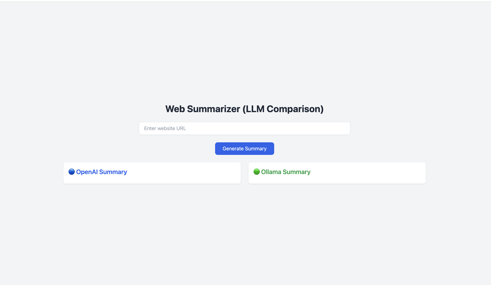
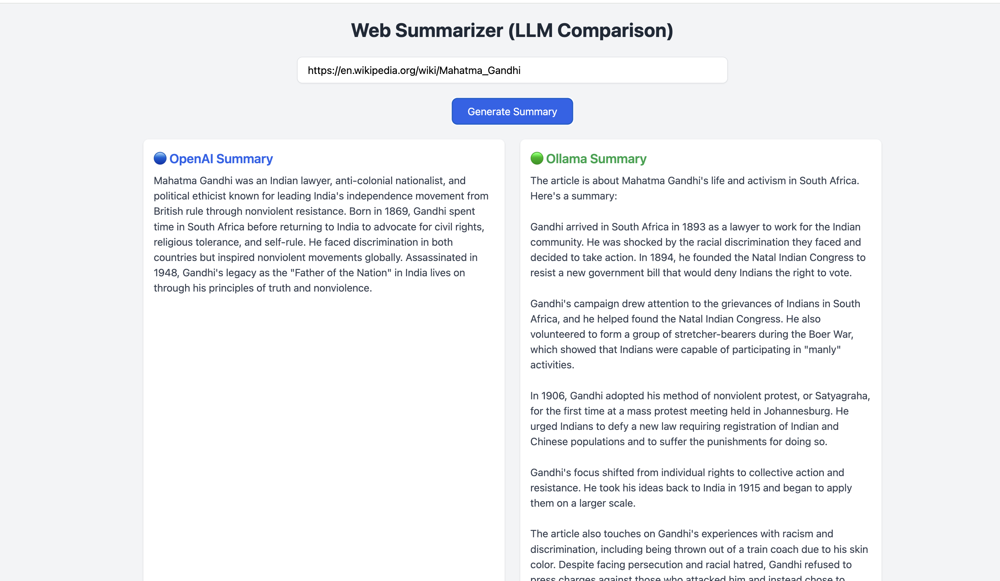

# 🧠 Web Summarizer using LLMs (OpenAI + Ollama)

This is a full-stack project that summarizes content from any webpage using both:
- 🔵 OpenAI GPT (via API)
- 🟢 Ollama running a local model (like LLaMA 3)

It allows users to compare summaries side-by-side between cloud-hosted and local LLMs.

---

## 🌐 Project Overview

| Component     | Tech Stack                     |
|---------------|--------------------------------|
| Frontend      | React + Tailwind CSS           |
| Backend       | Flask + OpenAI SDK + BeautifulSoup |
| Local Model   | Ollama (with llama3)           |

---

## 🔍 Features

- URL input to fetch any webpage
- Strips out unwanted tags (`nav`, `footer`, etc.)
- Summarizes content using:
  - **GPT-3.5/GPT-4o via OpenAI API**
  - **LLaMA3 via Ollama (local)**
- Side-by-side comparison of summaries
- Token limit applied to avoid timeout
- Tailwind-styled responsive frontend

---

## 🚀 How to Run

### 📦 Backend (Flask + OpenAI + Ollama)

1. Create `.env` in `Backend/` with:

```
OPENAI_API_KEY=sk-xxxxxxxxxxxxxxxxxxxxx
```

2. Install dependencies:

```bash
pip install -r requirements.txt
```

3. Run backend:

```bash
python backend.py
```

Runs on: `http://localhost:5000`

---

### 💻 Frontend (React + Tailwind)

1. Install dependencies:

```bash
npm install
```

2. Start React app:

```bash
npm start
```

Opens at: `http://localhost:3000`

---

## 🧪 API Endpoint

**POST** `/summarize`

Request:

```json
{
  "url": "https://en.wikipedia.org/wiki/OpenAI"
}
```

Response:

```json
{
  "openai_summary": "...",
  "ollama_summary": "..."
}
```

---

## 📷 Screenshots





---


## 📄 License

MIT License.  
Made with ❤️ by [@Nithin1829](https://github.com/Nithin1829)
